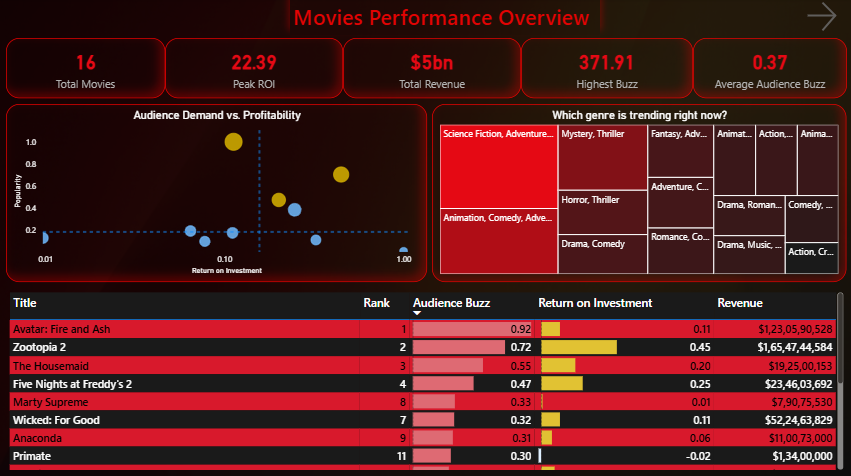
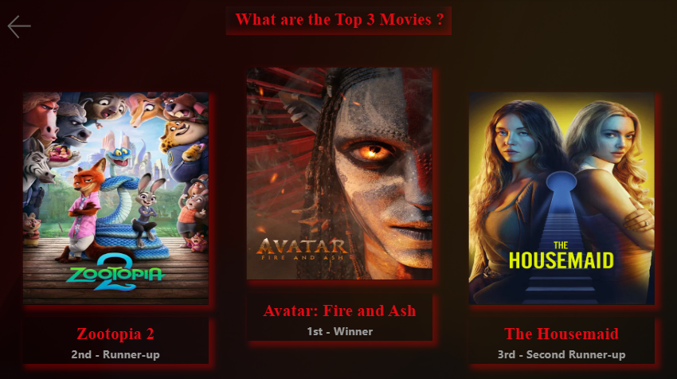
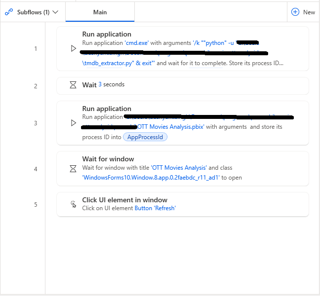

# 🎬 OTT Movie Scout: Finding Our Next Big Hit

## 🎯 Project Goal
Deciding which movie to add to a streaming platform is a multi-million dollar gamble. Usually, platforms just look at raw popularity. I built an automated system that finds movies that are both **popular** and **profitable**.

To identify the best acquisition targets, I used a custom **80/20 Selection Logic**:
* **80% Audience Buzz** (Market demand and talkability)
* **20% ROI Efficiency** (Financial safety and return on investment)

---

## 🏆 The Final Result
This is the "brain" of the project. The podium automatically updates to show the top 3 movies we should buy right now based on our 80/20 math.

*Caption: Dynamic rankings powered by real-time TMDB data.*

---

## 🛠️ Tech Stack & Libraries
To handle the data and automation, I used **Python 3.10+** with the following libraries:

* **`pandas`**: For data cleaning and creating the final CSV.
* **`requests`**: To fetch real-time movie data from the TMDB API.
* **`python-dotenv`**: To securely manage API keys.
* **`pathlib` & `os`**: To handle file paths across different folders.
* **`datetime` & `time`**: To manage date filtering and API rate limits.

---

## 🔄 Automated Workflow (Power Automate Desktop)
I built a 5-step automation flow to ensure the dashboard stays fresh without any manual effort. 

**Step-by-Step Flow Logic:**
1.  **Run Application**: Launches `cmd.exe` with arguments `/k ""python" -u "path\tmdb_extractor.py" & exit"`. This runs the python program and shows the live extraction progress in a "Normal" window.
2.  **Wait (3 Seconds)**: Ensures the new data is fully saved to the CSV file.
3.  **Run Application**: Opens the `.pbix` report in a **Maximized** window.
4.  **Wait for Window**: Pauses until the "OTT Movies Analysis" window is open and focused.
5.  **Click UI Element**: Automatically clicks the **'Refresh'** button in the Power BI ribbon to update all visuals.

---

## 🔍 Strategic Analysis
I created a **Strategic Acquisition Map** (Scatter Chart) to visualize where movies land in the market.
* **Top-Right (The Gold Mine):** High-demand, High-profit "Superstars".
* **Top-Left (The Risk):** Popular movies that are expensive to produce relative to their return.

*Caption: Visualizing profitability vs. popularity to minimize financial risk.*

---

## 🚀 How to Run This Project

### **1. Prerequisites**
* **Python 3.10+**.
* **TMDB API Key** (Place it in a `.env` file as `TMDB_API_KEY=your_key`).
* **🌍 VPN (Mandatory)**: A VPN is required to connect to the TMDB API servers properly.
* **Power BI Desktop**.
#### 🌍 VPN Note
TMDB API access can be **region-restricted or unstable** in some locations.  
Using a VPN ensures consistent connectivity during data extraction.

### **2. Execution**
1.  Turn on your **VPN**.
2.  Open your terminal and run: `pip install pandas requests python-dotenv`.
3.  Run the script: `python src/tmdb_extractor.py`.
4.  Open the Power BI report in the `/powerbi` folder and hit **Refresh**.

---

## 📂 Project Structure
* **`/data`**: Processed CSV datasets.
* **`/src`**: Python extraction scripts.
* **`/powerbi`**: Dashboard `.pbix` file.
* **`/assets`**: Project screenshots and visuals.
